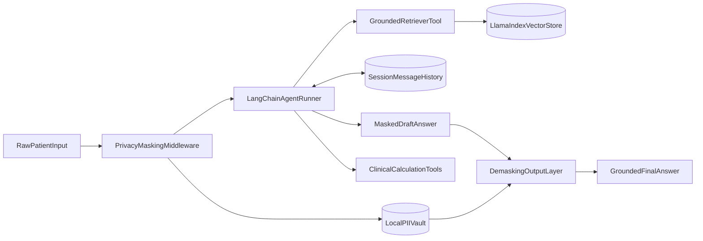

# AfyaPlus Enterprise RAG Agent System

Week 2 capstone for AfyaPlus Health: an audit-ready medical insurance verification and clinical routing system. Raw patient input passes through Kenyan PII masking, a LangChain orchestration core with session memory, defensive calculation tools, and a grounded LlamaIndex knowledge vault before a de-masked final answer is returned.

## Architecture



### Components

| Layer | Module | Responsibility |
|---|---|---|
| Privacy middleware | `src/privacy/masking.py` | Mask Kenyan phones, emails, `AP-######`, `HOSP-########`; validate no residual PII before dispatch |
| Knowledge vault | `src/rag/ingestion.py` | LlamaIndex ingestion with `SentenceSplitter`, OpenAI embeddings, persisted `storage/` index |
| Retriever tool | `src/rag/retriever_tool.py` | LangChain `@tool` with similarity floor, citations, and fixed refusal phrase |
| Clinical tools | `src/tools/clinical_math.py` | Medication volume and BMI calculators with defensive validation |
| Agent runner | `src/agent/runner.py` | `AgentExecutor` + `RunnableWithMessageHistory` for multi-turn context |
| Pipeline | `src/pipeline.py` | mask → assert clean → agent → de-mask orchestration |
| CLI | `main.py` | Single-turn, interactive, and demo modes |

## Orchestration design choices

- **LangChain as controller**: Tool-calling agent decides when to retrieve policy text vs. run calculations.
- **LlamaIndex as knowledge vault**: Document parsing, semantic chunking, and vector storage stay in LlamaIndex; retrieval is exposed to LangChain as a single grounded tool.
- **Three tools only**: `search_afyaplus_knowledge_manual`, `calculate_medication_volume`, `calculate_diagnostic_metric` — avoids tool overload confusion.
- **LangChain 1.x compatibility**: `AgentExecutor` and `create_tool_calling_agent` import from `langchain_classic.agents` (not `langchain.agents`).

## Token management

| Parameter | Value | Rationale |
|---|---|---|
| Chunk size | 512 | Sentence-boundary segments via `SentenceSplitter` |
| Chunk overlap | 64 | Preserves cross-section policy context |
| `similarity_top_k` | 3 | Balanced recall without flooding the agent context |
| Similarity floor | 0.25 | Rejects weak matches; returns fixed refusal |
| Chat model | `gpt-4o-mini` | Cost-efficient tool-calling |
| Embed model | `text-embedding-3-small` | High-fidelity local vector storage |
| Temperature | 0.0 | Deterministic routing and policy answers |
| History cap | 12 messages | Prevents context window blow-up in long sessions |
| Max agent iterations | 6 | Bounds tool-call loops |

## Compliance guardrails (Kenya Data Protection Act 2019)

1. **Mask before dispatch**: Phone numbers (`+254`, `254`, `0` prefixes with separators), emails, member IDs, and hospital IDs are replaced with `[MASKED_*]` tokens locally.
2. **Local vault**: Original values never leave the application process during model or retrieval calls.
3. **Residual-leak validation**: `assert_clean()` aborts dispatch if any PII pattern survives masking.
4. **De-mask at output boundary only**: Re-injection happens after the agent completes, before the operator sees the response.
5. **Grounded policy answers**: Insurance and routing claims must cite internal manual sources; out-of-scope questions receive `Information not found.`

Run with `--verbose` to inspect the masked payload actually sent to the model:

```powershell
python main.py --verbose "My phone is 0712345678. Is dental covered on Silver?"
```

Expected: raw phone replaced by `[MASKED_PHONE_1]` in the verbose output; original phone restored only in the final answer.

## Setup

1. Activate the workspace virtual environment (or create one):

```powershell
cd capstone-project-week2
python -m venv .venv
.\.venv\Scripts\Activate.ps1
pip install -r requirements.txt
```

2. Copy environment template and add a **direct OpenAI** API key (required for embeddings):

```powershell
copy .env.example .env
```

```
OPENAI_API_KEY=sk-proj-your-key
CHAT_MODEL=gpt-4o-mini
EMBED_MODEL=text-embedding-3-small
```

Leave `OPENAI_BASE_URL` unset. OpenRouter does not provide an `/embeddings` endpoint.

3. Verify API connectivity:

```powershell
python main.py --verify-api
```

## Run

Single inquiry:

```powershell
python main.py "Does Silver tier cover routine dental checkups?"
```

Multi-turn session (memory):

```powershell
python main.py --interactive --session-id patient-001
```

Scripted demo (memory + RAG + math tool + refusal):

```powershell
python main.py --demo --verbose
```

Offline unit tests (no API calls):

```powershell
python -m unittest discover -s tests -v
```

## Sample demo transcript

```
--- Turn 1 ---
Patient: Hi, I'm David. My phone is 0712 345 678 and email is david@example.com.
         I'm on Silver tier — is a routine dental checkup covered?
[privacy] masked payload dispatched:
Hi, I'm David. My phone is [MASKED_PHONE_1] and email is [MASKED_EMAIL_1].
I'm on Silver tier — is a routine dental checkup covered?
Agent: Yes — under Silver tier, routine dental cleaning is covered (one per year)...
       Contact: 0712 345 678, david@example.com

--- Turn 2 ---
Patient: Do you remember my name? Also calculate medication volume: 500 mg twice daily for 7 days at 250 mg/mL.
Agent: Your name is David. Total volume: 28.00 mL (2.00 mL per dose x 2/day x 7 days).

--- Turn 3 ---
Patient: What are the best tourist beaches in Mombasa?
Agent: Information not found.
```

> **Note:** Live demo requires an OpenAI account with available embedding and chat quota. A `429 insufficient_quota` error means billing must be topped up before `--demo` or `--verify-api` will succeed.

## Repository layout

```text
capstone-project-week2/
├── main.py
├── src/
│   ├── config.py
│   ├── privacy/masking.py
│   ├── rag/ingestion.py
│   ├── rag/retriever_tool.py
│   ├── tools/clinical_math.py
│   ├── agent/runner.py
│   └── pipeline.py
├── knowledge-manual/
├── tests/
└── storage/            (gitignored, built on first run)
```

## Git workflow

| Branch | Purpose |
|---|---|
| `main` | Scaffolding only (`.gitignore`, `requirements.txt`, `.env.example`) |
| `feat-rag-agent-system` | All feature code, tests, and documentation |

After creating a GitHub repository:

```powershell
git remote add origin https://github.com/YOUR_USER/afyaplus-rag-agent.git
git push -u origin main
git push -u origin feat-rag-agent-system
```

Open a pull request from `feat-rag-agent-system` → `main`, review, and merge.

## Rubric self-check

| Criterion (Weight) | How this project addresses it |
|---|---|
| RAG Pipeline Engineering (30%) | `SentenceSplitter(512/64)`, `text-embedding-3-small`, persisted `storage/`, retriever tool with similarity floor and source citations, fixed refusal for out-of-scope queries |
| Agent Design & Tool Calling (30%) | Three `@tool` functions with type hints, docstrings, try/except; `AgentExecutor` with `max_iterations` and `handle_parsing_errors` |
| Git Flow & Code Quality (20%) | Standalone repo, scaffolding on `main`, features on `feat-rag-agent-system`, semantic commits, PR-ready branch |
| Ethical Safeguards (20%) | Kenyan phone/email/ID regex middleware, local vault, `assert_clean()` leak check, de-mask only at output |

## Known limitations

- De-masking depends on the model preserving `[MASKED_*]` tokens verbatim in its response.
- This system assists with insurance verification and routing; it is not a medical device and does not replace clinician review.
- First index build requires OpenAI embedding API access; subsequent runs reload from `storage/`.
- Session memory is in-process only (not persisted across process restarts).
