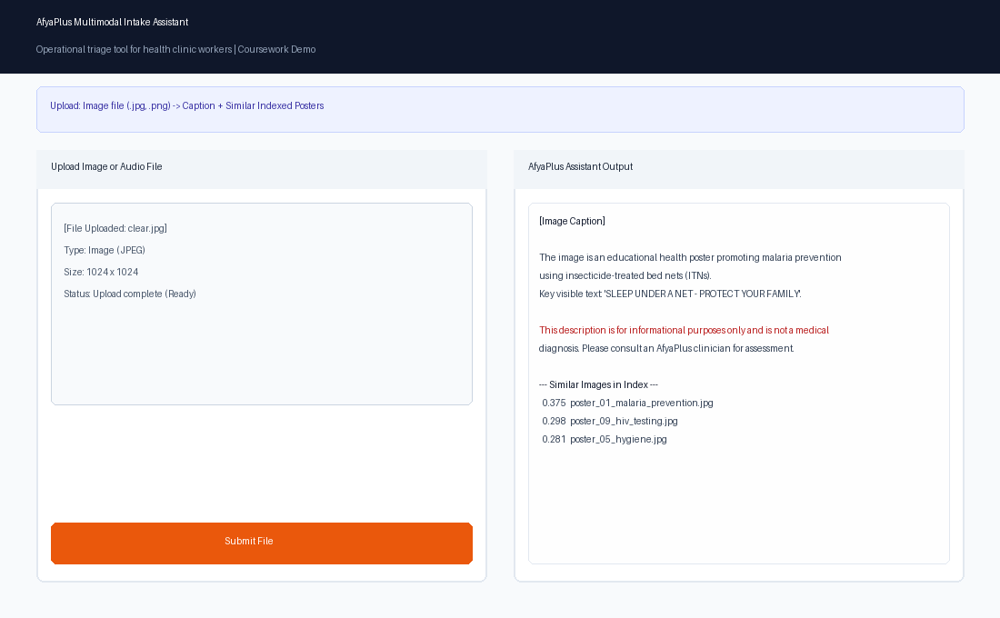
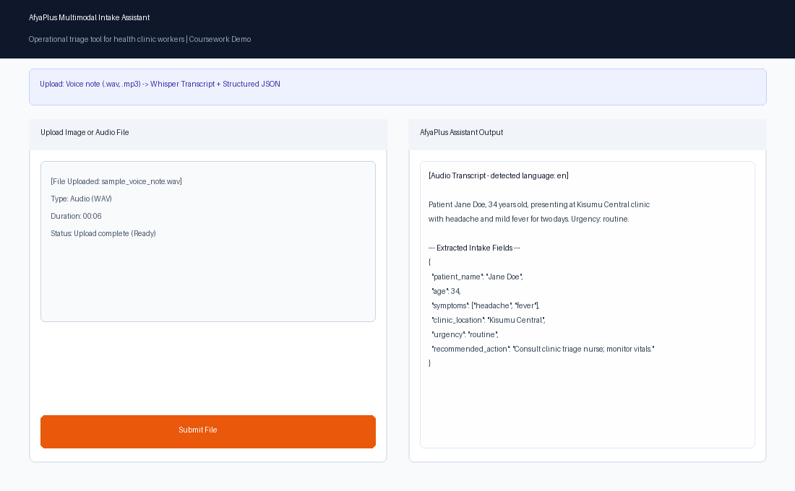

# AfyaPlus Multimodal Intake Assistant

## Overview

A multimodal clinical intake application for the **AfyaPlus** health domain that accepts either an **image** or an **audio file** and produces meaningful, safe text output. The system integrates three pipelines built across Weeks 1–5:

1. **CLIP Image Retrieval** — semantic text-to-image search over 16 health-education posters
2. **GPT-4o Vision Captioning** — constrained, non-diagnostic image descriptions with mandatory safety disclaimers
3. **Whisper Transcription + GPT-4o Extraction** — speech-to-text with structured JSON field extraction (patient name, symptoms, urgency)

All three pipelines are unified behind a single **Gradio** web interface with an input router that automatically dispatches images and audio to the correct pipeline.

**API path used:** OpenAI (GPT-4o for captioning/extraction, Whisper for transcription). CLIP retrieval runs locally and costs nothing.

## Project Structure

```
capstone-project-week5/
├── images/               # 16 health-domain images for the CLIP retrieval index
├── test_images/          # 3 test images: clear, ambiguous, out-of-scope
├── audio/                # Sample audio file for transcription testing
├── build_index.py        # Builds the CLIP retrieval index (image_index.pkl)
├── search.py             # Text-to-image search with MIN_SIMILARITY threshold
├── caption_image.py      # GPT-4o vision captioning with safety constraints
├── transcribe_audio.py   # Whisper transcription + structured JSON extraction
├── router.py             # Input-routing logic (image vs audio)
├── app.py                # Gradio application entry point
├── evaluation.md         # Before/after evaluation table for all 3 capabilities
├── stakeholder_memo.md   # Plain-language business recommendation for Clinical Director
├── requirements.txt      # Python dependencies
├── .env.example          # API key template
└── README.md             # This file
```

## How to Reproduce

### 1. Environment setup

```bash
cd capstone-project-week5
python -m venv venv
# Windows:
venv\Scripts\activate
# macOS/Linux:
# source venv/bin/activate

pip install -r requirements.txt
```

### 2. Configure API key

```bash
copy .env.example .env
# Edit .env and add your OpenAI API key
```

### 3. Build the CLIP index

```bash
python build_index.py
```

Expected output: `Indexed 16 images into image_index.pkl`

### 4. (Optional) Test individual pipelines

```bash
# Test search
python search.py

# Test captioning (requires OPENAI_API_KEY)
python caption_image.py test_images/clear.jpg

# Test transcription (requires OPENAI_API_KEY)
python transcribe_audio.py audio/sample_voice_note.wav
```

### 5. Launch the Gradio app

```bash
python app.py
```

Open the printed local URL (typically `http://127.0.0.1:7860`) in your browser.

## Screenshots

### Image Upload Result
*(Upload any health image → factual description + disclaimer)*



### Audio Upload Result
*(Upload a voice note → transcript + extracted fields)*



## Safety Note

- **Image captions are for informational and operational purposes only and are not a medical diagnosis.** Every response includes a mandatory disclaimer enforced in code.
- Unclear or blurry images trigger a **"HUMAN REVIEW REQUIRED"** flag instead of a guess.
- Non-health images are **politely refused**.
- Transcription fields that are not clearly mentioned are set to **"NOT_MENTIONED"** — the system never fabricates data.
- This is coursework, not a production AfyaPlus deployment or certified medical device.

## Evaluation & Business Recommendation

- **Evaluation table:** See [`evaluation.md`](evaluation.md) for the before/after comparison across all three capabilities.
- **Stakeholder memo:** See [`stakeholder_memo.md`](stakeholder_memo.md) for the plain-language go/no-go recommendation with named safety risks and mitigations.

## Further Reading

- [Learning Transferable Visual Models From Natural Language Supervision (Radford et al., 2021)](https://arxiv.org/abs/2103.00020)
- [OpenAI Vision Guide](https://platform.openai.com/docs/guides/vision)
- [Robust Speech Recognition via Large-Scale Weak Supervision (Radford et al., 2022)](https://arxiv.org/abs/2212.04356)
- [Gradio Documentation](https://www.gradio.app/docs)
- [NIST AI Risk Management Framework](https://www.nist.gov/itl/ai-risk-management-framework)
